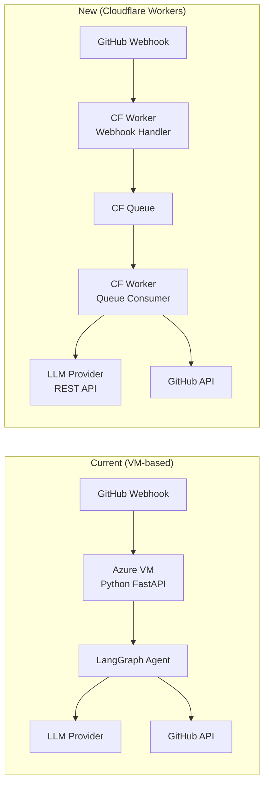

# Migrate AI Auto-Debugger to Cloudflare Workers

## Problem & Background

The current AI Auto-Debugger is a **Python/FastAPI/LangGraph** app
that requires a VM (Azure B1s) to host. The user no longer has
access to a VM and wants to use **Cloudflare Workers** (free tier)
to replace it entirely. The [.env](file:///c:/AM/GitHub/github-actions-ai-auto-debugger/.env) file is also bloated with 1364
lines of unrelated keys from other projects and needs cleanup.

### Architecture Shift



**Key decisions:**

1. **JavaScript, not Python** — CF Workers run V8 isolates.
   The entire Python codebase (FastAPI, LangGraph,
   LangChain) is replaced with vanilla JavaScript modules.
2. **CF Queues for background work** — The webhook handler
   returns `202 Accepted` immediately and enqueues the job.
   A Queue consumer handles the long-running AI pipeline
   with **unlimited CPU time** (vs 30s wall-time for
   HTTP handlers on Free plan).
3. **Direct REST API calls to LLM providers** — No LangChain.
   All supported providers (Cerebras, Groq, Mistral, Google
   Gemini, etc.) expose OpenAI-compatible `/v1/chat/completions`
   endpoints. A lightweight factory builds the correct
   `baseUrl` + headers per provider.
4. **Zero hosting cost** — CF Workers Free plan: 100k
   requests/day, 10 million Queue operations/month. The
   AI API keys are the only cost (all providers offer
   free tiers).

> [!IMPORTANT]
> The Python `app/`, `tests/`, `venv/`, [requirements.txt](file:///c:/AM/GitHub/github-actions-ai-auto-debugger/requirements.txt),
> [scripts/setup-vm.sh](file:///c:/AM/GitHub/github-actions-ai-auto-debugger/scripts/setup-vm.sh), and the VM [deploy.yml](file:///c:/AM/GitHub/github-actions-ai-auto-debugger/.github/workflows/deploy.yml) will all be
> **deleted**. This is a complete rewrite, not a port.

---

## User Review Required

> [!CAUTION]
> The entire Python codebase (`app/`, `tests/`, `venv/`,
> [requirements.txt](file:///c:/AM/GitHub/github-actions-ai-auto-debugger/requirements.txt)) will be **deleted** and replaced with a
> JavaScript Cloudflare Worker. The [.env](file:///c:/AM/GitHub/github-actions-ai-auto-debugger/.env) file will be trimmed
> from 1364 lines to ~40 lines. **Confirm this is acceptable
> before proceeding.**

> [!IMPORTANT]
> GitHub Repository Secrets must be configured after deployment:
> `CLOUDFLARE_API_TOKEN`, `CLOUDFLARE_ACCOUNT_ID`,
> `WEBHOOK_SECRET`, `GITHUB_APP_ID`, `GITHUB_PRIVATE_KEY`,
> `AI_PROVIDER`, `AI_MODEL`, `CEREBRAS_API_KEY` (or whichever
> provider key). These are managed via `wrangler secret put`.

> [!WARNING]
> CF Workers Free plan limitations:
> - HTTP handler: 10ms CPU / 30s wall time
> - Queue consumer: Unlimited CPU / 15 min wall time
> - 100k requests/day, 10M queue operations/month
> - Zero cold start (V8 isolates)
>
> If the AI pipeline takes >15 min, consider upgrading to
> the $5/mo Workers Paid plan.

---

## Proposed Changes

### 1. [.env](file:///c:/AM/GitHub/github-actions-ai-auto-debugger/.env) Cleanup

#### [MODIFY] [.env](file:///c:/AM/GitHub/github-actions-ai-auto-debugger/.env)

**Reduce from 1364 lines → ~40 lines.** Keep ONLY:

| Category | Variables to Keep |
|---|---|
| **GitHub App** | `WEBHOOK_SECRET`, `GITHUB_APP_ID`, `GITHUB_PRIVATE_KEY` |
| **AI Provider** | `AI_PROVIDER`, `AI_MODEL` |
| **AI API Keys** | `CEREBRAS_API_KEY`, `GROQ_API_KEY`, `NVIDIA_API_KEY`, `GOOGLE_API_KEY` (aliased from `GEMINI_API_KEY`), `MISTRAL_API_KEY`, `COHERE_API_KEY`, `OPENROUTER_API_KEY`, `HUGGINGFACE_API_KEY`, `GITHUB_MODELS_TOKEN` |
| **Cloudflare** | `CLOUDFLARE_ACCOUNT_ID`, `CLOUDFLARE_API_TOKEN`, `CLOUDFLARE_EMAIL` |
| **Observability** | `LANGFUSE_PUBLIC_KEY`, `LANGFUSE_SECRET_KEY`, `LANGFUSE_BASE_URL` |

**Everything else is deleted** — all the hosting providers,
CMS keys, payment keys, social media tokens, newsletter
services, data APIs, gitmirror configs, etc.

---

#### [MODIFY] [.env.example](file:///c:/AM/GitHub/github-actions-ai-auto-debugger/.env.example)

Rewrite to match the new minimal variable set with clear
documentation sections.

---

### 2. Cloudflare Worker Project Setup

#### [NEW] [wrangler.jsonc](file:///c:/AM/GitHub/github-actions-ai-auto-debugger/wrangler.jsonc)

Wrangler v4 configuration:
- `name`: `ai-auto-debugger`
- `main`: `src/index.js`
- `compatibility_date`: `2025-12-01`
- `compatibility_flags`: `["nodejs_compat"]`
- `queue.producers`: binding `DEBUG_QUEUE`, queue
  `ai-auto-debugger-queue`
- `queue.consumers`: same queue, `max_batch_size: 1`,
  `max_retries: 2`, `dead_letter_queue: ai-debugger-dlq`
- Secrets: `WEBHOOK_SECRET`, `GITHUB_APP_ID`,
  `GITHUB_PRIVATE_KEY`, `AI_PROVIDER`, `AI_MODEL`,
  provider API keys, Langfuse keys

---

### 3. Worker Source Code

All new files under `src/`:

#### [NEW] [src/index.js](file:///c:/AM/GitHub/github-actions-ai-auto-debugger/src/index.js)

Main Worker entry point with two handlers:

```javascript
export default {
  async fetch(request, env, ctx) {
    // Route: POST /webhook → verify + enqueue
    // Route: GET /health → 200 OK
  },
  async queue(batch, env) {
    // Process each message through the AI pipeline
  }
};
```

- **[fetch](file:///c:/AM/GitHub/github-actions-ai-auto-debugger/app/ai_agent.py#34-43) handler**: Parses `X-GitHub-Event` and
  `X-Hub-Signature-256`, validates HMAC, filters for
  `workflow_run` + `completed` + `failure`, rejects
  `[bot]` senders, enqueues to `DEBUG_QUEUE`, returns `202`.
- **`queue` handler**: Calls the agent pipeline for each
  message. Queue handler has unlimited CPU time for
  AI processing.

---

#### [NEW] [src/verify.js](file:///c:/AM/GitHub/github-actions-ai-auto-debugger/src/verify.js)

HMAC-SHA256 webhook signature verification using **Web Crypto
API** (CF Workers built-in, no dependencies):

```javascript
export async function verifySignature(
  secret, payload, signature
) {
  // Use crypto.subtle.importKey + crypto.subtle.sign
  // Compare with constant-time comparison
}
```

---

#### [NEW] [src/github.js](file:///c:/AM/GitHub/github-actions-ai-auto-debugger/src/github.js)

GitHub API client functions (all use [fetch()](file:///c:/AM/GitHub/github-actions-ai-auto-debugger/app/ai_agent.py#34-43)):

- `generateJWT(appId, privateKeyPem)` — RS256 JWT using
  Web Crypto API's `crypto.subtle.importKey` + [sign](file:///c:/AM/GitHub/github-actions-ai-auto-debugger/app/main.py#16-20)
- `getInstallationToken(jwt, installationId)` — POST to
  `/app/installations/{id}/access_tokens`
- `getWorkflowLogs(token, owner, repo, runId)` — GET logs
  URL, follow redirect, handle zip (using `fflate` or
  manual deflate for zip parsing)
- `getFileContent(token, owner, repo, path, ref)` — GET
  file contents, base64-decode
- `commitFile(token, owner, repo, path, branch, content,
  sha, message)` — PUT to update file via Contents API

---

#### [NEW] [src/jwt.js](file:///c:/AM/GitHub/github-actions-ai-auto-debugger/src/jwt.js)

RSA-SHA256 JWT generation for GitHub App authentication
using Web Crypto API (no external JWT library needed):

```javascript
export async function createGitHubJWT(appId, privateKeyPem) {
  // 1. Parse PEM → ArrayBuffer
  // 2. crypto.subtle.importKey("pkcs8", ...)
  // 3. Build JWT header + payload
  // 4. crypto.subtle.sign("RSASSA-PKCS1-v1_5", ...)
  // 5. Return base64url-encoded JWT
}
```

---

#### [NEW] [src/providers.js](file:///c:/AM/GitHub/github-actions-ai-auto-debugger/src/providers.js)

Multi-provider LLM factory (mirrors the Python
[providers.py](file:///c:/AM/GitHub/github-actions-ai-auto-debugger/app/providers.py) but uses direct REST API calls):

```javascript
const PROVIDERS = {
  cerebras: {
    baseUrl: "https://api.cerebras.ai/v1",
    envKey: "CEREBRAS_API_KEY",
    defaultModel: "qwen-3-235b-a22b-instruct-2507",
  },
  groq: {
    baseUrl: "https://api.groq.com/openai/v1",
    envKey: "GROQ_API_KEY",
    defaultModel: "llama-3.3-70b-versatile",
  },
  mistral: {
    baseUrl: "https://api.mistral.ai/v1",
    envKey: "MISTRAL_API_KEY",
    defaultModel: "mistral-large-latest",
  },
  google_gemini: {
    baseUrl: "https://generativelanguage.googleapis.com/v1beta/openai",
    envKey: "GOOGLE_API_KEY",
    defaultModel: "gemini-2.0-flash",
  },
  nvidia: {
    baseUrl: "https://integrate.api.nvidia.com/v1",
    envKey: "NVIDIA_API_KEY",
    defaultModel: "meta/llama-3.1-8b-instruct",
  },
  cohere: {
    baseUrl: "https://api.cohere.com/v2",
    envKey: "COHERE_API_KEY",
    defaultModel: "command-r-plus",
  },
  huggingface: {
    baseUrl: "https://api-inference.huggingface.co/v1",
    envKey: "HUGGINGFACE_API_KEY",
    defaultModel: "Qwen/Qwen2.5-Coder-32B-Instruct",
  },
  openrouter: {
    baseUrl: "https://openrouter.ai/api/v1",
    envKey: "OPENROUTER_API_KEY",
    defaultModel: "meta-llama/llama-3-70b-instruct",
  },
  github_models: {
    baseUrl: "https://models.inference.ai.azure.com",
    envKey: "GITHUB_MODELS_TOKEN",
    defaultModel: "gpt-4o",
  },
};

export async function chatCompletion(env, messages) {
  // 1. Read AI_PROVIDER + AI_MODEL from env
  // 2. Look up provider config
  // 3. Resolve API key from env[config.envKey]
  // 4. POST to {baseUrl}/chat/completions
  // 5. Parse and return response content
}

export function listProviders() { return PROVIDERS; }
```

All providers use the **OpenAI-compatible `/v1/chat/completions`
endpoint** — same request/response format, different base URLs.

---

#### [NEW] [src/agent.js](file:///c:/AM/GitHub/github-actions-ai-auto-debugger/src/agent.js)

The AI debugging pipeline (replaces LangGraph). A simple
sequential async pipeline:

```javascript
export async function runDebugPipeline(env, payload) {
  // Step 1: Authenticate — generate JWT, get installation token
  // Step 2: Fetch logs — download workflow run logs (zip)
  // Step 3: Analyze error — LLM call to identify files
  // Step 4: Fetch code — get file contents from GitHub
  // Step 5: Generate fix — LLM call to produce fixed code
  // Step 6: Commit fix — push fixed files via GitHub API
}
```

Each step logs progress. If any step fails, the error is
logged and the pipeline aborts gracefully (no partial commits).

The LLM prompts are identical to the current Python versions:
- **Analyze**: "Return JSON with `files` key listing
  file paths that caused the failure"
- **Fix**: "Return ONLY the complete fixed code for {path}.
  No markdown, no explanations."

---

### 4. GitHub Actions CI/CD

#### [DELETE] [deploy.yml](file:///c:/AM/GitHub/github-actions-ai-auto-debugger/.github/workflows/deploy.yml)

Remove the VM SSH deployment workflow entirely.

---

#### [NEW] [deploy.yml](file:///c:/AM/GitHub/github-actions-ai-auto-debugger/.github/workflows/deploy.yml)

New Wrangler-based deployment:

```yaml
name: Deploy Worker
on:
  push:
    branches: [main]
jobs:
  deploy:
    runs-on: ubuntu-latest
    steps:
      - uses: actions/checkout@v4
      - uses: cloudflare/wrangler-action@v3
        with:
          apiToken: ${{ secrets.CLOUDFLARE_API_TOKEN }}
          accountId: ${{ secrets.CLOUDFLARE_ACCOUNT_ID }}
          secrets: |
            WEBHOOK_SECRET
            GITHUB_APP_ID
            GITHUB_PRIVATE_KEY
            AI_PROVIDER
            AI_MODEL
            CEREBRAS_API_KEY
            GROQ_API_KEY
            NVIDIA_API_KEY
            GOOGLE_API_KEY
            MISTRAL_API_KEY
            COHERE_API_KEY
            OPENROUTER_API_KEY
            HUGGINGFACE_API_KEY
            GITHUB_MODELS_TOKEN
            LANGFUSE_PUBLIC_KEY
            LANGFUSE_SECRET_KEY
            LANGFUSE_BASE_URL
        env:
          WEBHOOK_SECRET: ${{ secrets.WEBHOOK_SECRET }}
          GITHUB_APP_ID: ${{ secrets.GITHUB_APP_ID }}
          GITHUB_PRIVATE_KEY: ${{ secrets.GITHUB_PRIVATE_KEY }}
          AI_PROVIDER: ${{ secrets.AI_PROVIDER }}
          AI_MODEL: ${{ secrets.AI_MODEL }}
          CEREBRAS_API_KEY: ${{ secrets.CEREBRAS_API_KEY }}
          GROQ_API_KEY: ${{ secrets.GROQ_API_KEY }}
          NVIDIA_API_KEY: ${{ secrets.NVIDIA_API_KEY }}
          GOOGLE_API_KEY: ${{ secrets.GOOGLE_API_KEY }}
          MISTRAL_API_KEY: ${{ secrets.MISTRAL_API_KEY }}
          COHERE_API_KEY: ${{ secrets.COHERE_API_KEY }}
          OPENROUTER_API_KEY: ${{ secrets.OPENROUTER_API_KEY }}
          HUGGINGFACE_API_KEY: ${{ secrets.HUGGINGFACE_API_KEY }}
          GITHUB_MODELS_TOKEN: ${{ secrets.GITHUB_MODELS_TOKEN }}
          LANGFUSE_PUBLIC_KEY: ${{ secrets.LANGFUSE_PUBLIC_KEY }}
          LANGFUSE_SECRET_KEY: ${{ secrets.LANGFUSE_SECRET_KEY }}
          LANGFUSE_BASE_URL: ${{ secrets.LANGFUSE_BASE_URL }}
```

---

#### [MODIFY] [ci.yml](file:///c:/AM/GitHub/github-actions-ai-auto-debugger/.github/workflows/ci.yml)

Replace Python test pipeline with Node.js:

```yaml
name: CI
on:
  push:
    branches: [main]
  pull_request:
    branches: [main]
jobs:
  test:
    runs-on: ubuntu-latest
    steps:
      - uses: actions/checkout@v4
      - uses: actions/setup-node@v4
        with:
          node-version: "22"
      - run: npm install
      - run: npm run lint
      - run: npm test
```

---

### 5. Package Configuration

#### [NEW] [package.json](file:///c:/AM/GitHub/github-actions-ai-auto-debugger/package.json)

```json
{
  "name": "ai-auto-debugger",
  "version": "2.0.0",
  "type": "module",
  "private": true,
  "scripts": {
    "dev": "wrangler dev",
    "deploy": "wrangler deploy",
    "test": "vitest run",
    "lint": "biome check src/ tests/",
    "format": "biome format --write src/ tests/"
  },
  "devDependencies": {
    "wrangler": "^4",
    "vitest": "^3",
    "@biomejs/biome": "^1.9",
    "cloudflare:test": "..."
  },
  "dependencies": {
    "fflate": "^0.8"
  }
}
```

- **`fflate`**: Lightweight zip decompression (3kb gzipped)
  for parsing GitHub Actions log archives.
  Only external dependency.
- **Biome.js**: Linting + formatting per user rules.
- **Vitest**: Test runner (Cloudflare Workers compatible
  via `@cloudflare/vitest-pool-workers`).

---

#### [NEW] [biome.json](file:///c:/AM/GitHub/github-actions-ai-auto-debugger/biome.json)

Biome.js configuration for linting and formatting with
80 char line width.

---

### 6. Test Files (Vitest)

#### [NEW] [vitest.config.js](file:///c:/AM/GitHub/github-actions-ai-auto-debugger/vitest.config.js)

Configure Vitest with `@cloudflare/vitest-pool-workers`
for Workers-compatible testing.

---

#### [NEW] [tests/verify.test.js](file:///c:/AM/GitHub/github-actions-ai-auto-debugger/tests/verify.test.js)

- Test valid HMAC signature returns `true`
- Test invalid HMAC signature returns `false`
- Test missing/malformed signature returns `false`

---

#### [NEW] [tests/providers.test.js](file:///c:/AM/GitHub/github-actions-ai-auto-debugger/tests/providers.test.js)

- Test `listProviders()` returns all 9 providers
- Test `chatCompletion()` constructs correct URL/headers
  per provider (mocked [fetch](file:///c:/AM/GitHub/github-actions-ai-auto-debugger/app/ai_agent.py#34-43))
- Test invalid provider throws error
- Test missing API key throws error

---

#### [NEW] [tests/github.test.js](file:///c:/AM/GitHub/github-actions-ai-auto-debugger/tests/github.test.js)

- Test JWT generation produces valid RS256 token
- Test `getInstallationToken` calls correct endpoint
- Test `getFileContent` base64-decodes response
- Test `commitFile` sends correct PUT payload

---

#### [NEW] [tests/index.test.js](file:///c:/AM/GitHub/github-actions-ai-auto-debugger/tests/index.test.js)

- Test `POST /webhook` with valid signature → 202
- Test `POST /webhook` with invalid signature → 401
- Test `POST /webhook` with non-failure event → 200 ignored
- Test `POST /webhook` with bot sender → 200 ignored
- Test `GET /health` → 200
- Test `POST /unknown` → 404

---

#### [NEW] [tests/agent.test.js](file:///c:/AM/GitHub/github-actions-ai-auto-debugger/tests/agent.test.js)

- Test full pipeline with mocked GitHub API + LLM calls
- Test pipeline aborts on auth failure
- Test pipeline handles LLM parsing errors gracefully

---

### 7. Delete Legacy Files

#### [DELETE] [app/](file:///c:/AM/GitHub/github-actions-ai-auto-debugger/app/)

Remove entire Python package: [__init__.py](file:///c:/AM/GitHub/github-actions-ai-auto-debugger/app/__init__.py), [main.py](file:///c:/AM/GitHub/github-actions-ai-auto-debugger/app/main.py),
[ai_agent.py](file:///c:/AM/GitHub/github-actions-ai-auto-debugger/app/ai_agent.py), [github_api.py](file:///c:/AM/GitHub/github-actions-ai-auto-debugger/app/github_api.py), [providers.py](file:///c:/AM/GitHub/github-actions-ai-auto-debugger/app/providers.py), [models.py](file:///c:/AM/GitHub/github-actions-ai-auto-debugger/app/models.py),
[tracing.py](file:///c:/AM/GitHub/github-actions-ai-auto-debugger/app/tracing.py), and `__pycache__/`.

---

#### [DELETE] [tests/](file:///c:/AM/GitHub/github-actions-ai-auto-debugger/tests/) (Python tests only)

Remove all Python test files. New Vitest tests will be
in `tests/` directory with `.test.js` extension.

---

#### [DELETE] [requirements.txt](file:///c:/AM/GitHub/github-actions-ai-auto-debugger/requirements.txt)

No longer needed (replaced by `package.json`).

---

#### [DELETE] [scripts/setup-vm.sh](file:///c:/AM/GitHub/github-actions-ai-auto-debugger/scripts/setup-vm.sh)

VM setup script no longer needed.

---

#### [DELETE] [firebase-debug.log](file:///c:/AM/GitHub/github-actions-ai-auto-debugger/firebase-debug.log)

Stale log file.

---

#### [DELETE] [venv/](file:///c:/AM/GitHub/github-actions-ai-auto-debugger/venv/)

Python virtual environment no longer needed.

---

### 8. Documentation Updates

#### [MODIFY] [README.md](file:///c:/AM/GitHub/github-actions-ai-auto-debugger/README.md)

Complete rewrite to reflect:
- Cloudflare Workers architecture
- Zero-cost deployment
- New setup instructions (Wrangler secrets)
- Updated provider table
- Queue-based background processing
- New test commands (`npm test`)
- Removal of all VM references

---

#### [MODIFY] [.gitignore](file:///c:/AM/GitHub/github-actions-ai-auto-debugger/.gitignore)

Replace Python-focused rules with Node.js/Workers rules:
- `node_modules/`, `.wrangler/`, `dist/`
- Keep [.env](file:///c:/AM/GitHub/github-actions-ai-auto-debugger/.env)

---

### 9. Update Scripts

#### [MODIFY] [scripts/test-webhook.py](file:///c:/AM/GitHub/github-actions-ai-auto-debugger/scripts/test-webhook.py)

Keep but update the default URL to point to the new
Cloudflare Worker URL pattern:
`https://ai-auto-debugger.<account>.workers.dev/webhook`

---

## Verification Plan

### Automated Tests (Vitest)

```bash
npm install
npm test
```

Tests cover:
1. **HMAC verification** — valid/invalid/missing signatures
2. **Provider factory** — all 9 providers resolve correctly,
   invalid provider errors, missing key errors
3. **GitHub API client** — JWT generation, token exchange,
   file content decode, commit payload construction
4. **Webhook handler** — full request lifecycle with
   signature, event type, action/conclusion filtering
5. **Agent pipeline** — end-to-end with mocked externals

### Lint & Format

```bash
npm run lint
npm run format
```

### Manual Verification

1. **Deploy Worker**: Run `npx wrangler deploy` (requires
   `CLOUDFLARE_API_TOKEN` and `CLOUDFLARE_ACCOUNT_ID` set)
2. **Test webhook**: Run
   `python scripts/test-webhook.py https://ai-auto-debugger.<subdomain>.workers.dev/webhook <secret>`
   — expect `202` response
3. **Configure GitHub App**: Update the GitHub App webhook
   URL to point to the new Worker URL
4. **End-to-end**: Push a broken commit to a repo with the
   GitHub App installed, observe the Worker automatically
   creating a fix commit

> [!TIP]
> The user should update the GitHub App's webhook URL
> after deploying the Worker. The new URL will be:
> `https://ai-auto-debugger.<cf-subdomain>.workers.dev/webhook`
