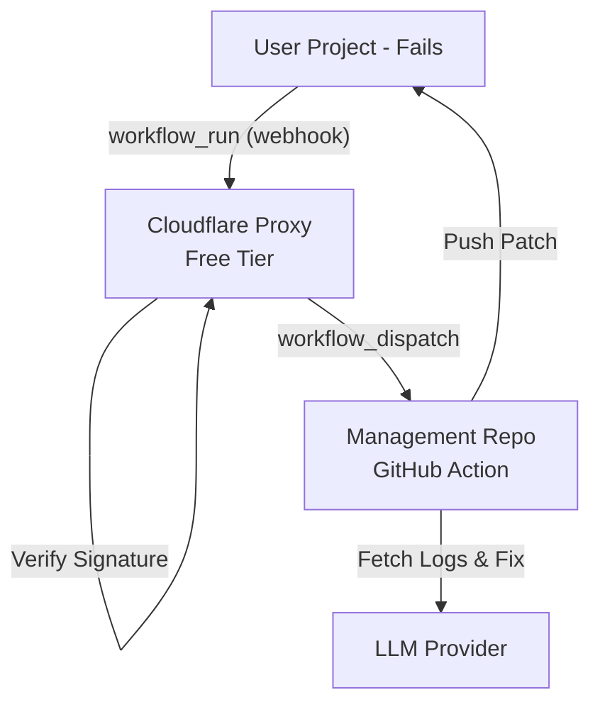

# 🤖 GitHub Actions AI Auto-Debugger

[](https://github.com/chirag127/github-actions-ai-auto-debugger/actions/workflows/ci.yml)
[](https://opensource.org/licenses/MIT)

A **completely free**, zero-configuration AI debugger that automatically analyzes and fixes failed GitHub Actions workflows across all your repositories.

---

## 🏗️ Architecture

The system uses a **Centralized Proxy Pattern** to achieve truly zero-cost operation and multi-repository support without project-level configuration.



- **Cloudflare Proxy**: A lightweight, high-performance script that handles GitHub webhooks and triggers the repair pipeline.
- **GitHub Action**: The core engine that performs deep log analysis, identifies the root cause, and generates code fixes.
- **Multi-Provider LLM**: Supports 9+ top-tier AI models (Cerebras, Groq, Gemini, NVIDIA, etc.) for high-quality repairs.

---

## 📋 Prerequisites

Before you begin, ensure you have the following:

- **Node.js 22+** and **pnpm 9+** installed.
- A **GitHub App** created and installed on your organization/account.
  - **Permissions**: `Actions (Read)`, `Contents (Write)`, `Metadata (Read-only)`.
  - **Events**: `Workflow run` (Completed).
- An **API Key** from one of the supported LLM providers (e.g., [Cerebras](https://cloud.cerebras.ai/)).
- A **Cloudflare Account** (Free tier is sufficient).
- **GitHub CLI (gh)** installed and authenticated (`gh auth login`).

---

## 🛠️ Installation

1.  **Clone the Management Repository**:
    ```bash
    git clone https://github.com/chirag127/github-actions-ai-auto-debugger.git
    cd github-actions-ai-auto-debugger
    ```

2.  **Install Dependencies**:
    ```bash
    pnpm install
    ```

---

## 🔐 Environment Variable Setup

1.  **Initialize the `.env` file**:
    ```bash
    cp .env.example .env
    ```

2.  **Configure your variables**:
    Refer to the detailed instructions inside the `.env` file for each setting.

3.  **Sync Secrets to GitHub**:
    Automatically deploy your `.env` values to GitHub Repository Secrets:
    ```powershell
    # Windows (PowerShell)
    ./scripts/sync-secrets.ps1
    ```

### Configuration Table

| Variable | Description | Source |
| :--- | :--- | :--- |
| `GH_APP_ID` | Your GitHub App ID | GitHub Settings |
| `GH_APP_PRIVATE_KEY` | PEM private key for the App | GitHub Settings |
| `WEBHOOK_SECRET` | Secret for HMAC verification | GitHub Settings |
| `GH_TOKEN` | PAT with `actions:write` on this repo | GitHub Settings |
| `AI_PROVIDER` | Chosen LLM provider name | LLM Dashboard |
| `AI_API_KEY` | API Key for the provider | LLM Dashboard |

---

## 🗄️ Database Migrations

This application is **entirely stateless**. It stores no persistent data and therefore requires **zero database migrations**. All processing is done in-memory within the GitHub Action runner and Cloudflare Worker.

---

## 🚀 Running the App

### Local Development
To test the AI repair pipeline locally without triggering a GitHub webhook:
1. Fill in the `TARGET_REPO_OWNER`, `TARGET_RUN_ID`, etc., in your `.env`.
2. Run the entry point:
   ```bash
   node src/index.js
   ```

### Production Deployment
1. **Deploy the Proxy**:
   ```bash
   pnpm run deploy
   ```
2. **Point the App**:
   Update your GitHub App's "Webhook URL" to the Cloudflare Worker URL provided by the deployment.

---

## 🧪 Running Tests

We use **Vitest** for a comprehensive testing suite that covers the AI pipeline, GitHub API client, and signature verification.

```bash
# Run all tests
pnpm test

# Run tests with coverage
pnpm run test:coverage

# Lint and format
pnpm run lint
pnpm run format
```

---

## 📦 Deployment

### Cloudflare Proxy
Managed via `Wrangler`. Deployment is automated on every push to `main` via the **Deploy Proxy Worker** workflow.

### GitHub Action
The repair engine is bundled into `dist/index.js` via **Rollup**. Ensure you commit the `dist` folder so GitHub can run the action without building it on every trigger.

---

## 🛠️ Additional Tools

- **Wrangler**: Use `pnpm dlx wrangler tail` to monitor live logs from your Proxy Worker.
- **GitHub CLI**: Use `gh secret list` to verify your synchronized secrets.
- **Biome**: Modern, high-performance linter and formatter used to enforce code quality.

---

## 📜 License
MIT © [chirag127](https://github.com/chirag127)
