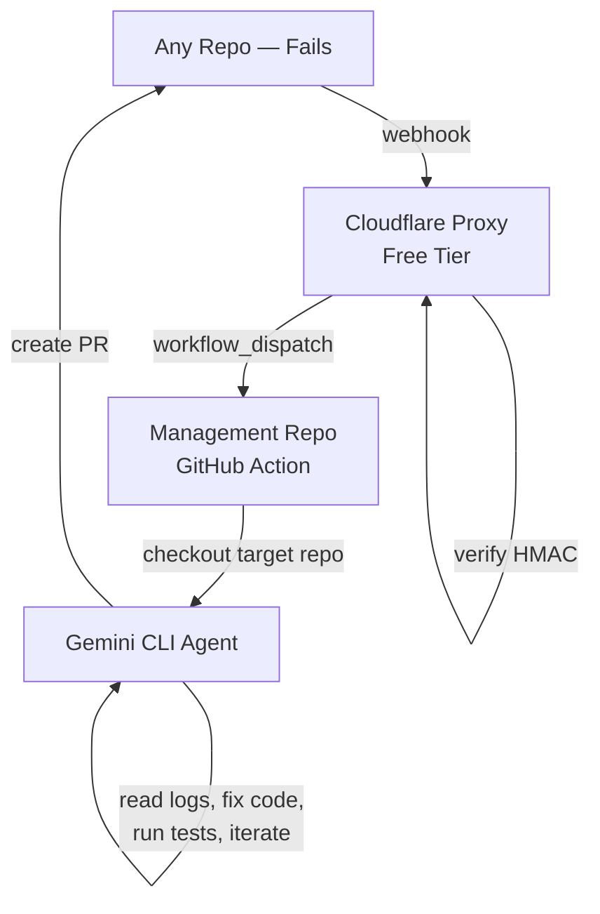

# 🤖 GitHub Actions AI Auto-Debugger

[](https://github.com/chirag127/github-actions-ai-auto-debugger/actions/workflows/ci.yml)
[](https://opensource.org/licenses/MIT)

A **completely free**, zero-configuration AI debugger that automatically analyzes and fixes failed GitHub Actions workflows across **all your repositories** using **Google Gemini CLI**.

> **Zero Config Per Repo** — Install the GitHub App once. Every repo it monitors gets automatic AI-powered fixes via PRs. No YAML files, no per-repo setup.

---

## 🏗️ Architecture



| Component | Role | Cost |
|-----------|------|------|
| **Cloudflare Proxy** | Receives webhooks, verifies HMAC, dispatches to central repo | Free |
| **GitHub Action** | Checks out the failed repo, runs Gemini CLI agentic debugger | Free |
| **Gemini CLI** | Full agentic AI — shell execution, file I/O, test verification, iterative fixes | Free (1K req/day) |

---

## 📋 Prerequisites

- A **GitHub App** installed on your organization/account
  - **Permissions**: `Actions (Read)`, `Contents (Write)`, `Pull Requests (Write)`, `Metadata (Read)`
  - **Events**: `Workflow run` (Completed)
- A **Google AI Studio API Key** ([get one free](https://aistudio.google.com/apikey))
- A **Cloudflare Account** (Free tier)
- **GitHub CLI** (`gh`) and **Node.js 22+**

---

## 🛠️ Installation

```bash
git clone https://github.com/chirag127/github-actions-ai-auto-debugger.git
cd github-actions-ai-auto-debugger
pnpm install
```

---

## 🔐 Environment Setup

1. Copy the example env:
   ```bash
   cp .env.example .env
   ```

2. Fill in your secrets (see detailed instructions inside `.env`).

3. Sync secrets to **GitHub**:
   ```powershell
   ./scripts/sync-secrets.ps1
   ```

4. Upload secrets to **Cloudflare** (only `WEBHOOK_SECRET` and `GITHUB_TOKEN` are needed by the proxy):
   ```bash
   echo "YOUR_WEBHOOK_SECRET" | pnpm dlx wrangler secret put WEBHOOK_SECRET
   echo "YOUR_GITHUB_PAT" | pnpm dlx wrangler secret put GITHUB_TOKEN
   ```

### Key Secrets

| Secret | Where | Purpose |
|--------|-------|---------|
| `GH_APP_ID` | GitHub | App authentication |
| `GH_APP_PRIVATE_KEY` | GitHub | App authentication |
| `GEMINI_API_KEY` | GitHub | Gemini CLI model access |
| `WEBHOOK_SECRET` | Cloudflare + GitHub | HMAC verification |
| `GITHUB_TOKEN` | Cloudflare | Proxy → dispatch trigger |

---

## 🗄️ Database Migrations

This application is **entirely stateless**. No database, no migrations. All processing happens in-memory within the GitHub Action runner.

---

## 🚀 Running the App

### Production (Automatic)
Once deployed, the system runs fully automatically:
1. A workflow fails in any monitored repo.
2. GitHub sends a webhook to the Cloudflare Proxy.
3. The Proxy triggers the central AI Debugger workflow.
4. Gemini CLI checks out the failed repo, reads logs, fixes code, runs tests, and creates a PR.

### Local Testing
```bash
# Test the proxy locally
pnpm dlx wrangler dev

# Run AI debugger manually (set TARGET_* vars in .env)
node src/index.js
```

---

## 🧪 Running Tests

```bash
pnpm test          # Run all tests (26 tests)
pnpm run lint      # Biome lint check
pnpm run format    # Biome format
pnpm run build     # Bundle dist/index.js
```

---

## 📦 Deployment

### 1. Deploy the Proxy to Cloudflare
```bash
pnpm run deploy
```
This deploys `src/proxy.js` to Cloudflare Workers (Free Tier).

### 2. Configure the GitHub App
- Set the **Webhook URL** to your Cloudflare Worker URL (e.g., `https://ai-auto-debugger-proxy.your-account.workers.dev/webhook`).
- Set the **Webhook Secret** to the same value as `WEBHOOK_SECRET`.

### 3. Install the App
Install the GitHub App on your account/organization. Select the repos you want monitored.

---

## 🛠️ Additional Tools

| Tool | Command | Purpose |
|------|---------|---------|
| **Wrangler** | `pnpm dlx wrangler tail` | Monitor live proxy logs |
| **GitHub CLI** | `gh secret list` | Verify synced secrets |
| **Biome** | `pnpm run lint` | Code quality |

---

## 📜 License
MIT © [chirag127](https://github.com/chirag127)
